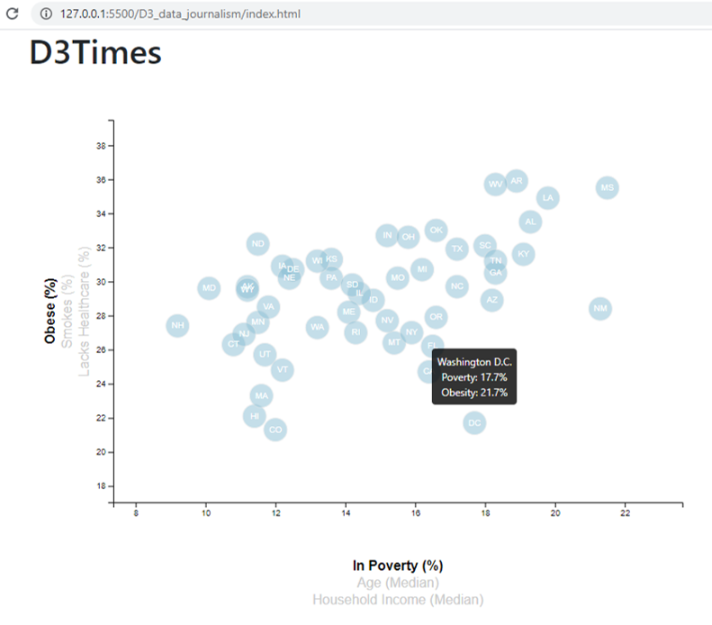
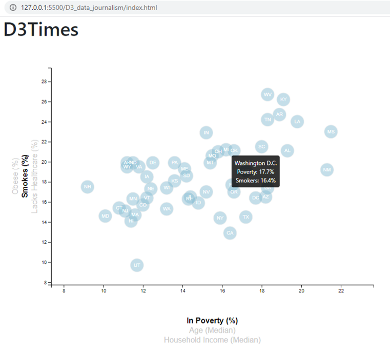
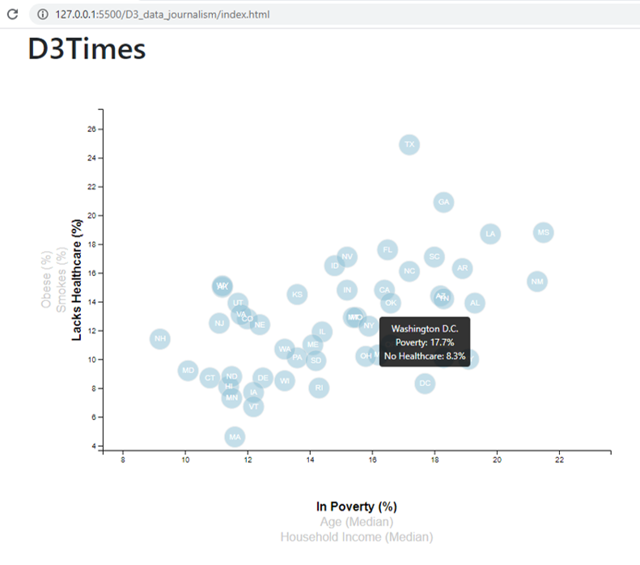
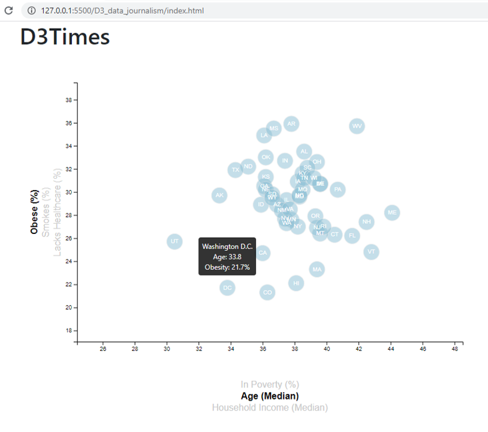
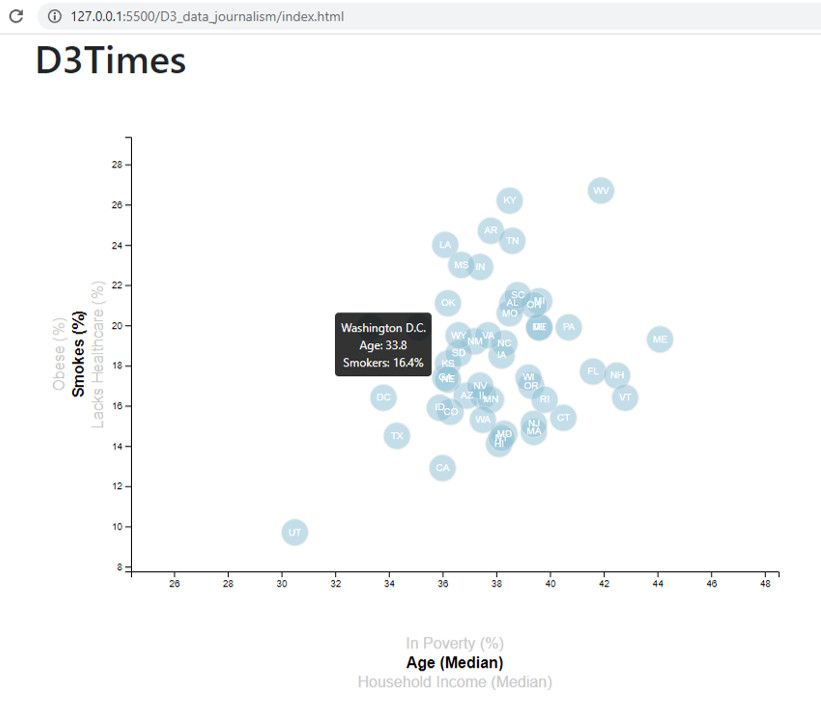
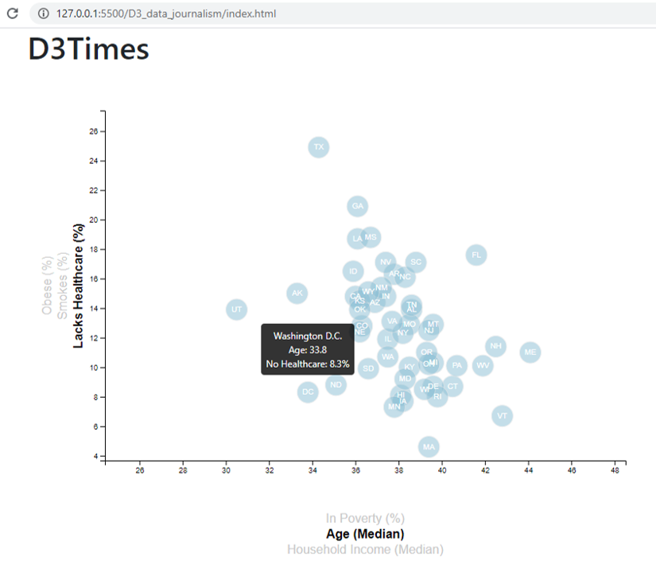
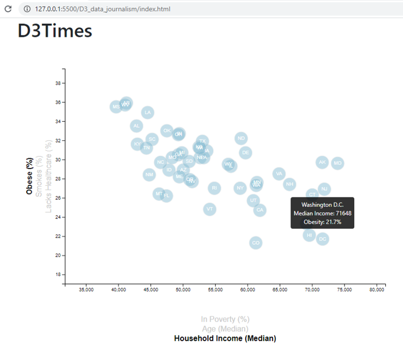
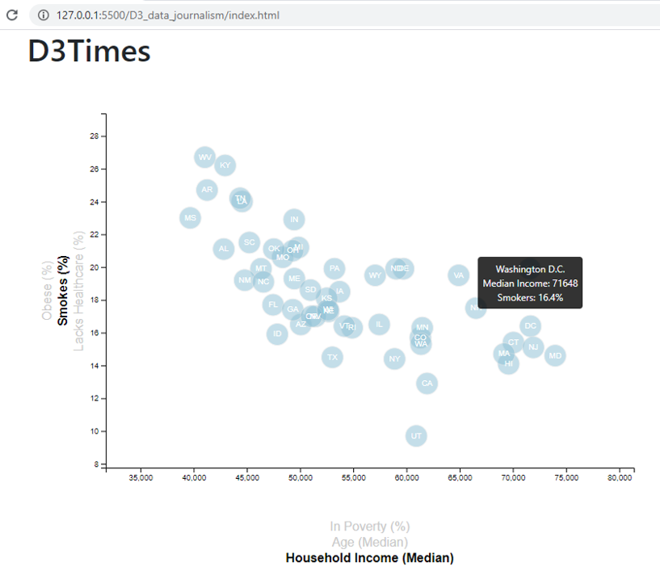
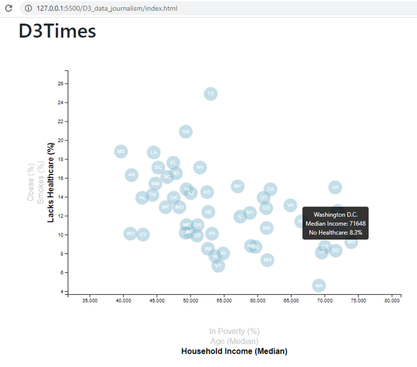

# **D3 Challenge**
This project uses D3 to visualize the current trends shaping people's lives, and to help readers understand the findings, simulating a journalism article.
Data for this study is sourced from the U.S. Census Bureau and Behaviorial Risk Factor Surveillance System, revealing how health markers like obesity, smoking, and lack of healthcare vary in relation to poverty, age and household income for the US states in 2014.

## **Analysis**
The interactive scatter plots reveal the following:
1. An overall positive correlation exists between poverty and the three health risk factors. With increase in poverty, percentages of obese and smokers are higher, and there is lesser access to healthcare.
2. No correlation is seen between age and obesity, as well as smoking. However, there seems to be a negative correlation between age and lack of healthcare, meaning people have increased access to healthcare as they age.
3. An overall positive correlation exists between household income and the three health risk factors. As household income rises, percentages of obese and smokers are lower, and there is greater access to healthcare.

## **Screenshots**

## *Poverty vs Obesity*

## *Poverty vs Smoking*

## *Poverty vs Lack of Healthcare*

## *Age vs Obesity*

## *Age vs Smoking*

## *Age vs Lack of Healthcare*

## *Income vs Obesity*

## *Income vs Smoking*

## *Income vs Lack of Healthcare*

## Technologies
* JavaScript
* D3
* HTML
* CSS
* Visual Studio Code
* Live Server

## Contact
Created by [@iCode13] - please feel free to contact me in case of questions!